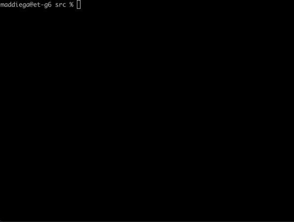

# Game of life

***== Получен Quest. На языке программирования Си разработать программу src/game_of_life.c, представляющую из себя визуализацию "The Game of Life". Для отображения графики использовать только символьную (ASCII) графику (с выводом в терминал). Необходимо реализовать в игре Game of life интерактивный режим, c настройкой скорости игры. ==***

* ***Графика*** 

Поле — прямоугольник 80 на 25 клеток.
Подразумевается, что поле "замкнуто само на себя", к примеру у нижнего правого квадратика соседом справа является нижний левый квадратик, а соседом снизу - верхний правый.

Предусмотреть начальную инициализацию состояния "игры" через stdin. Подготовить как минимум 5 файлов с начальными состоянием для быстрого запуска и инициализации через перенаправление ввода.

